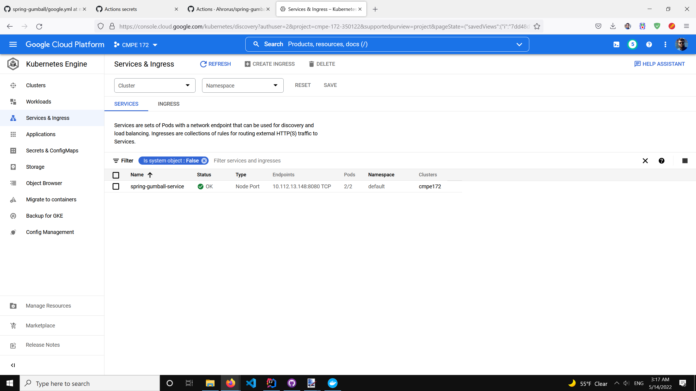
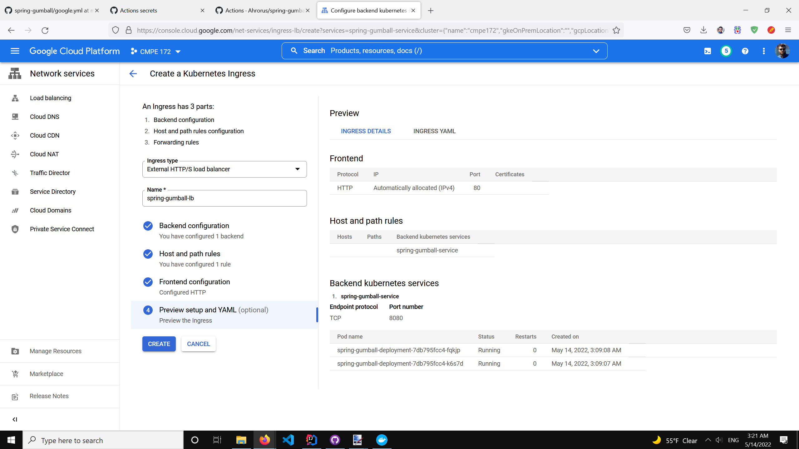
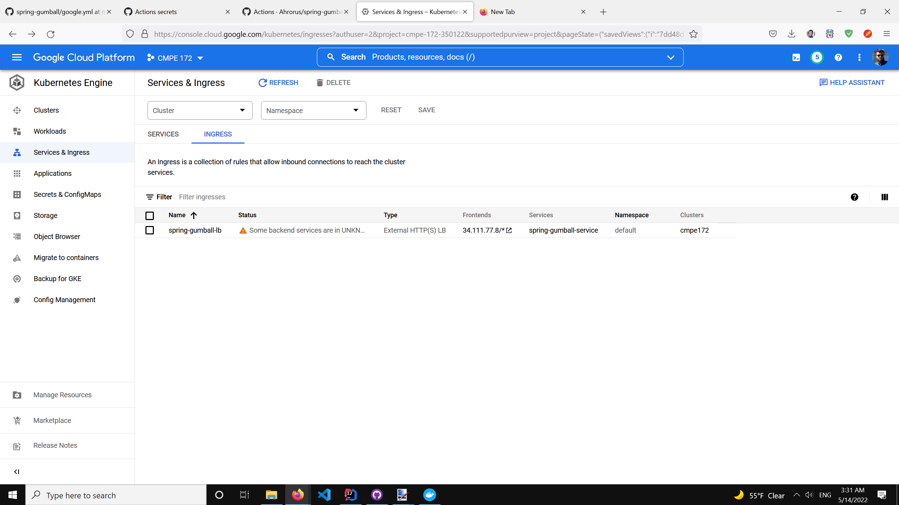
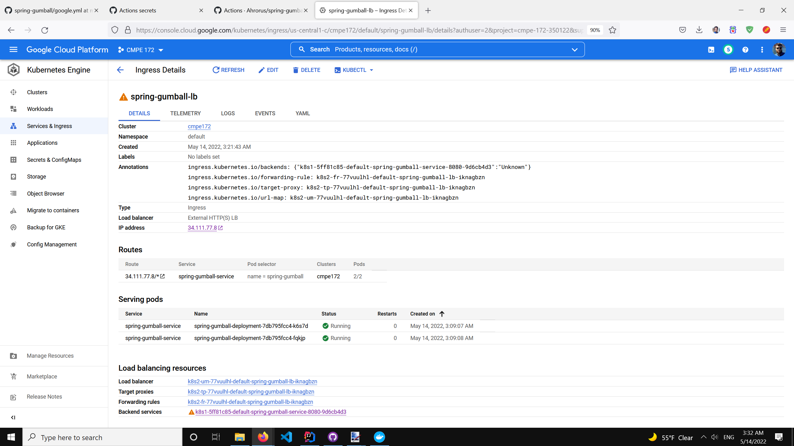
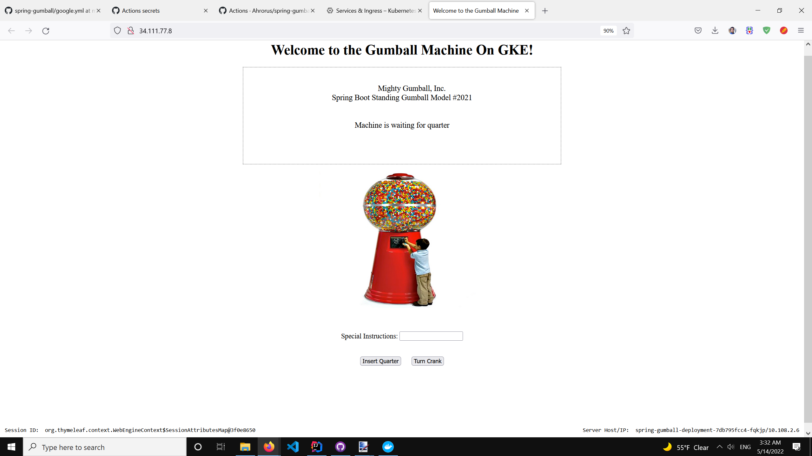

# CMPE 172 - Spring Gumball CI/CD

## CI Workflow (Part 1)

Below are screenshots of the proof of the working workflow to trigger a build on push or pull request on the main branch. Here, I updated the README file and triggered a build on push.

 

## CD Workflow (Part 2)

Below are screenshots of the proof of the working workflow for deployment in GKE.

### Configuring google.yml file in the repo

### Creating GitHub secret keys

### Triggering a deployment with release (first try)

There is an error before deployment began. Probably, due to the secret SA key. I have secret key as the private_key that I copied from the JSON file. I will now put the entire JSON secret key file as the secret key on GitHub.

### Triggering a deployment with release (second try)

It says that some backend services are in unknown state. Later, we see that in the bottom, it shows that there might be a problem with one of the services. The reason is unknown: could be that the deployment did not go very well because of us or just because GCP is imperfect, or maybe because I am using free trial version of GCP. Nonetheless, it is working:

