# CMPE 172 - Spring Gumball CI/CD

## CI Workflow (Part 1)

Below are screenshots of the proof of the working workflow to trigger a build on push or pull request on the main branch. Here, I updated the README file and triggered a build on push.

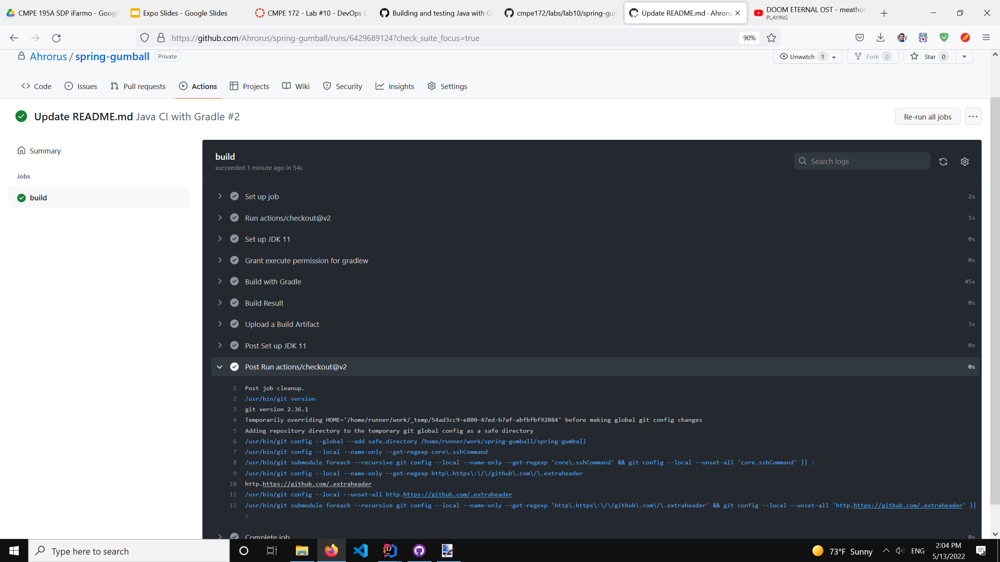

 

## CD Workflow (Part 2)

Below are screenshots of the proof of the working workflow for deployment in GKE.

### Configuring google.yml file in the repo

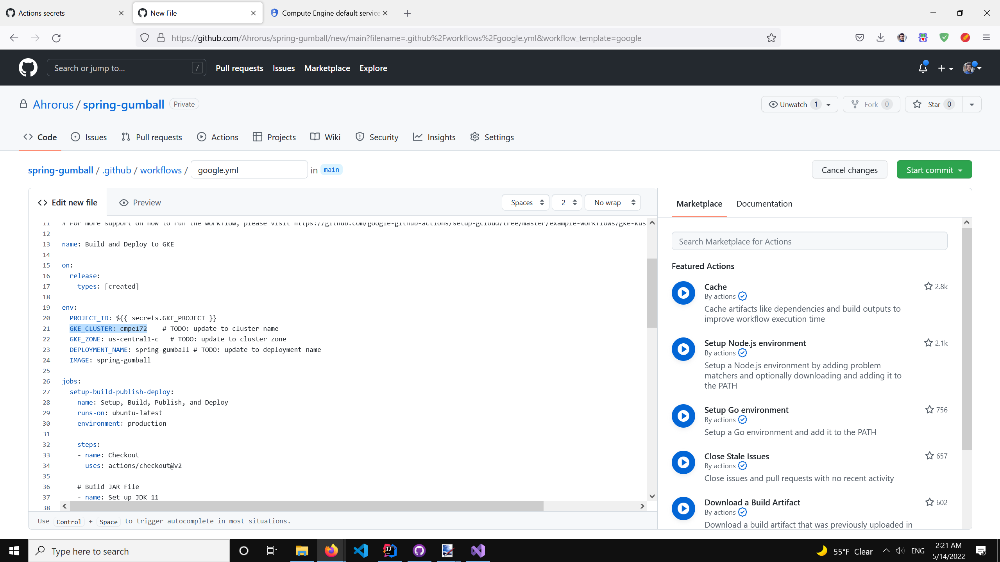

### Creating GitHub secret keys

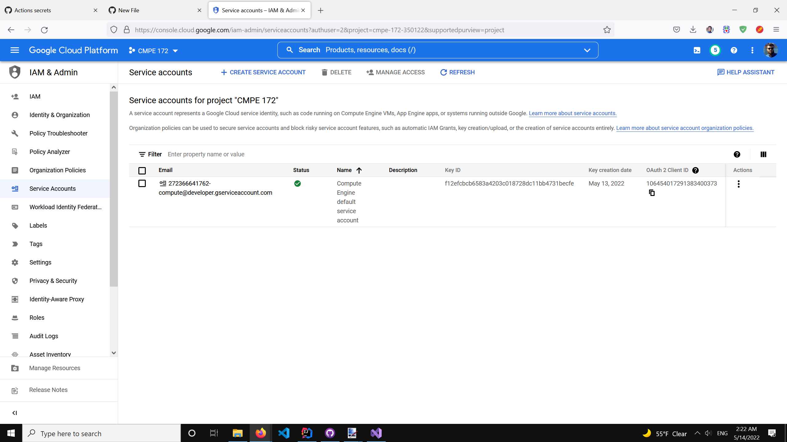

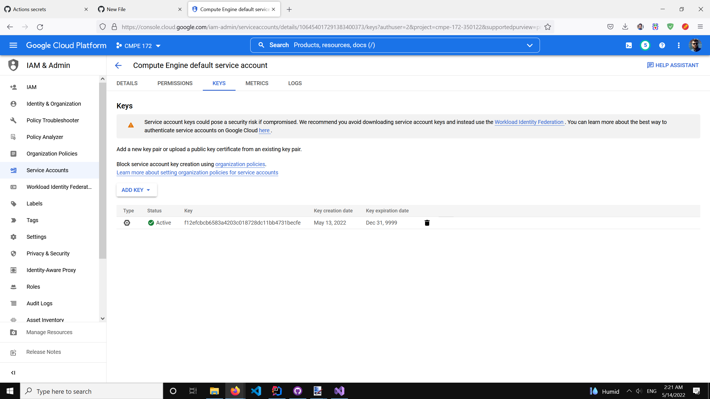

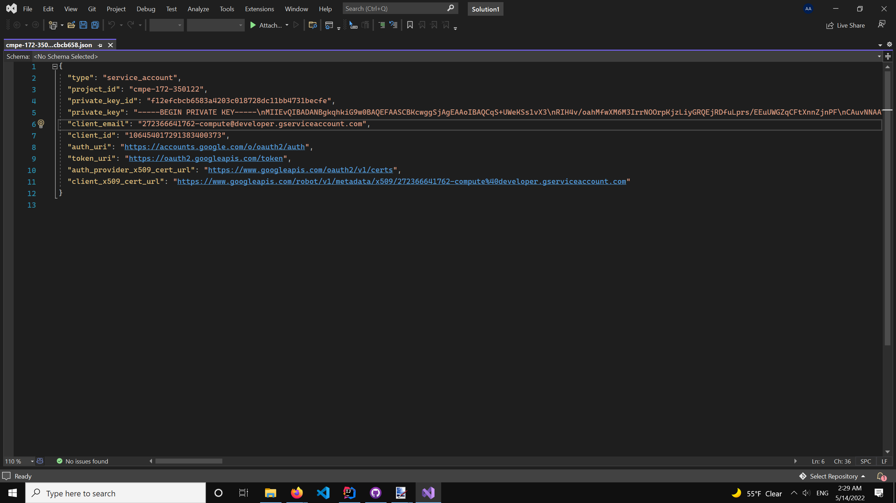

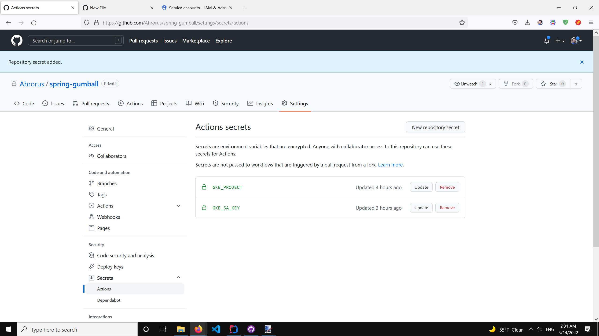

### Triggering a deployment with release

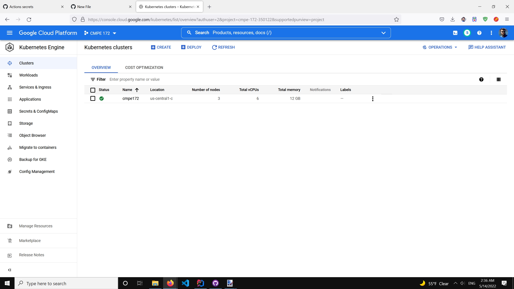

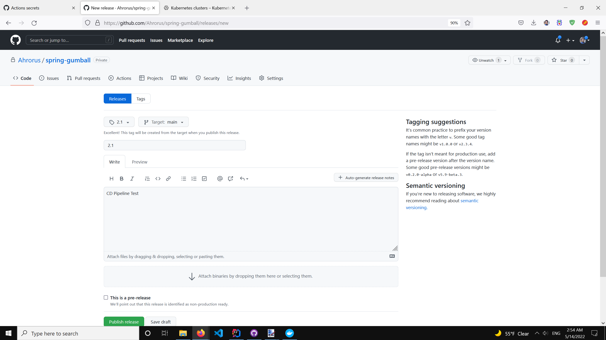

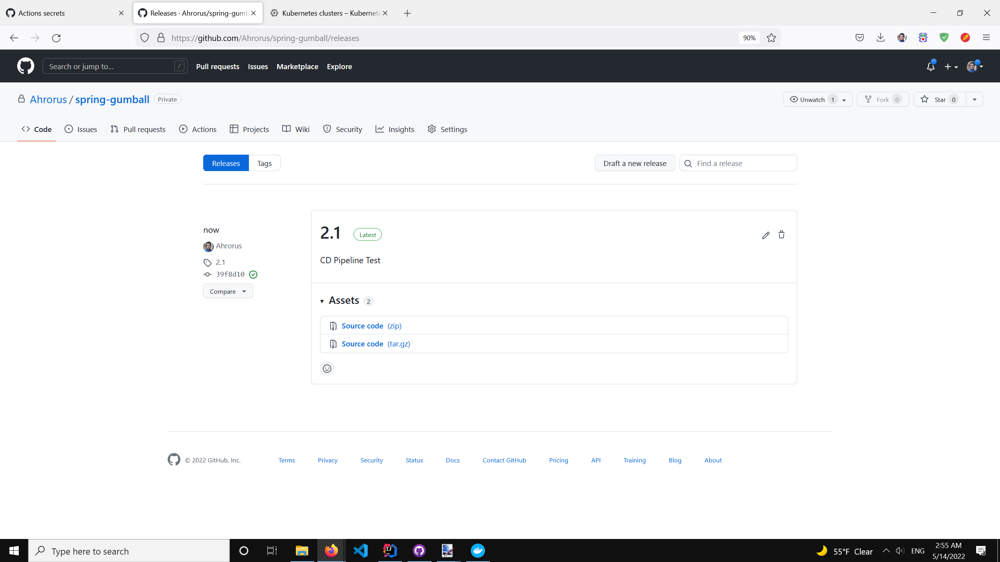

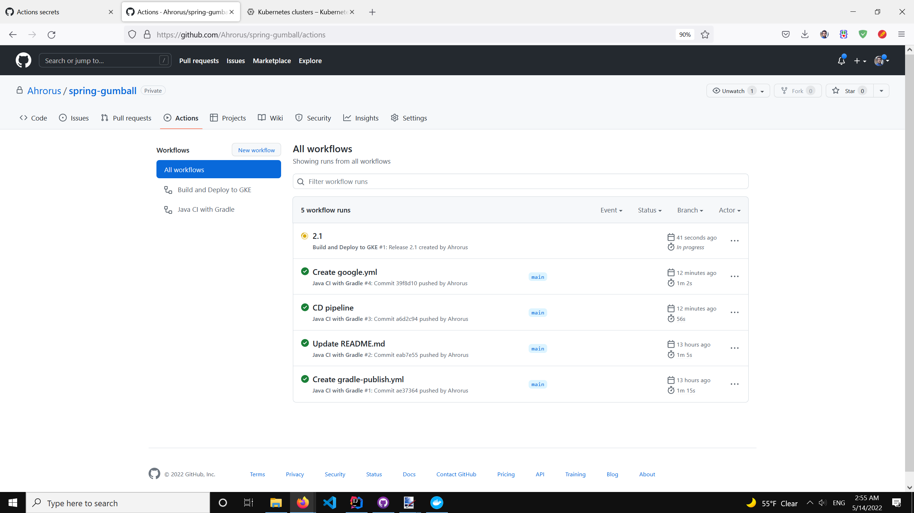

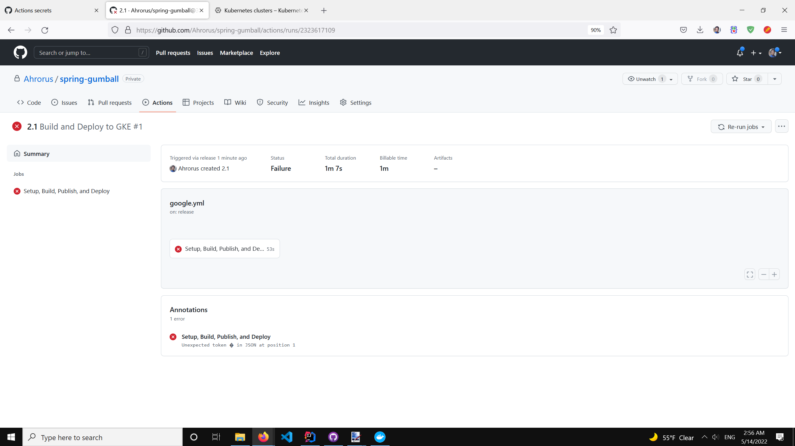

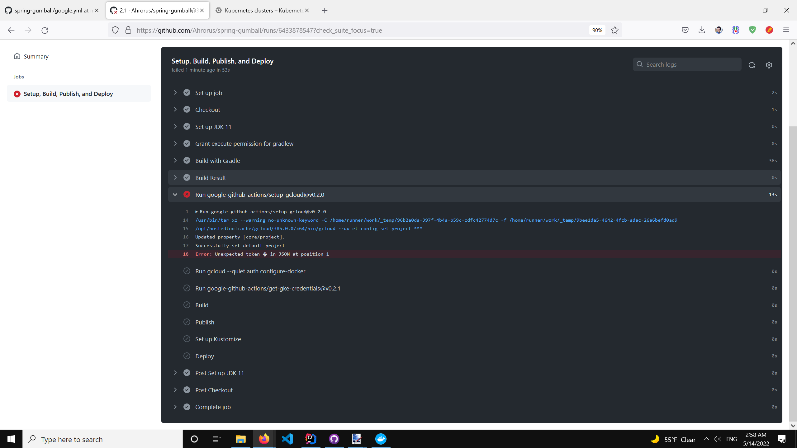

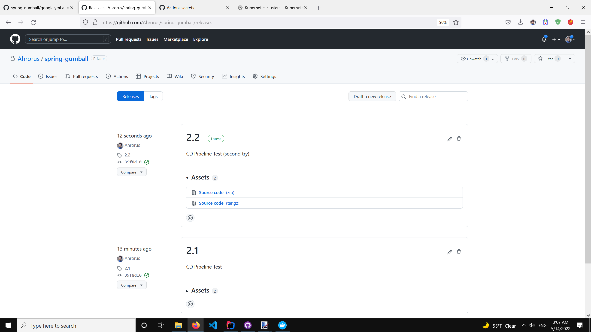

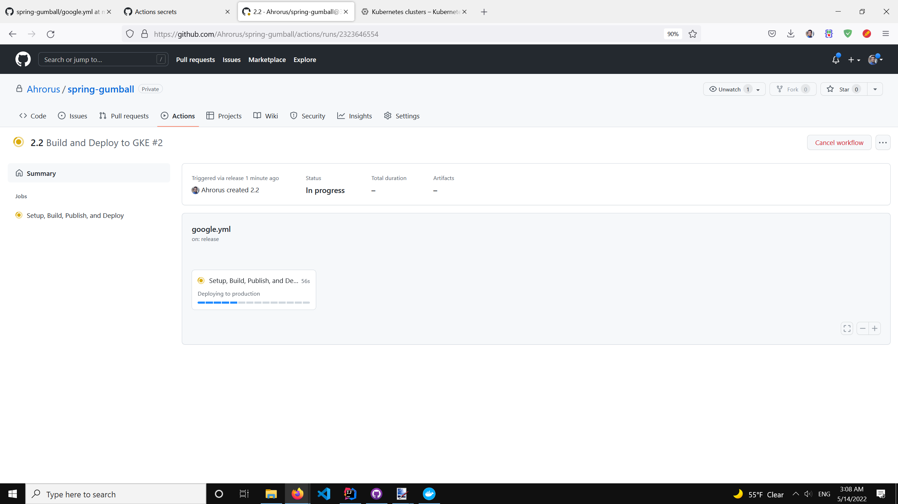

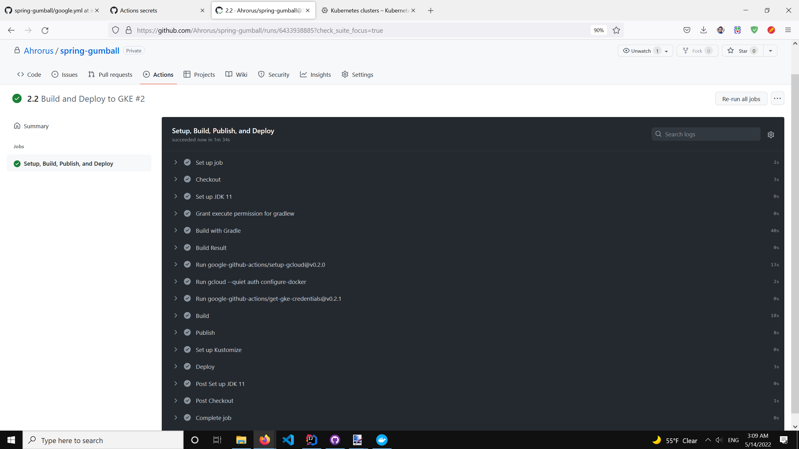

 

## Lab Notes

### Asdf

### Qwer

